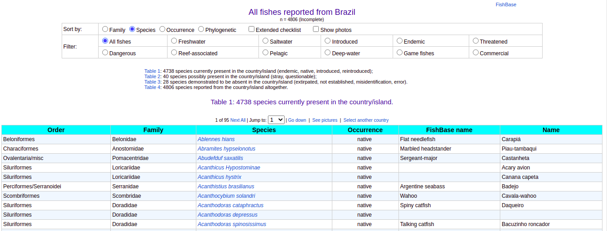
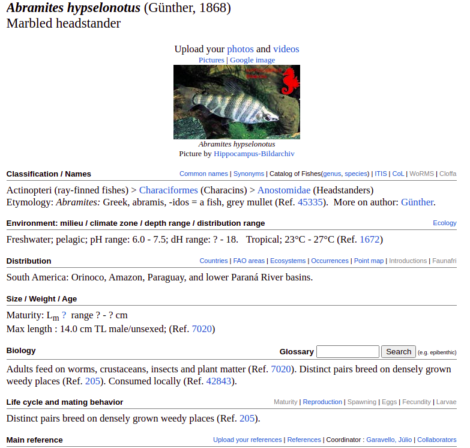
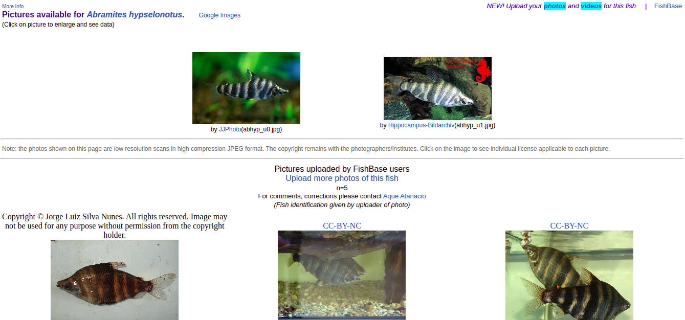

# crawler

Architecture for the data pipelines.

## Here's my plan:
We get the Brazilian common names table and start from there.
- 

The link gives us the fish ID, which can be used to get images and more info.
- 
- 

This data can later be parsed and pretty-printed for a wiki style GUI.
